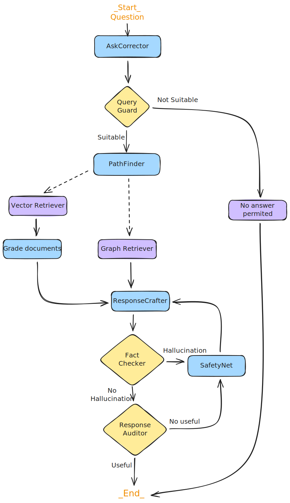

## CHATBOT USFQ: MANUAL DEL ESTUDIANTE

Repositorio que contiene la arquitectura desarrollada para la implementación del ChatBot de la USFQ sobre el Manual del Estudiante.

### BASE VECTORIAL

La base vectorial que se ha escogido es [Milvus](https://milvus.io/es), para levantar la arquitectura de esta base, se utiliza docker.

+ [Docker(Linux)](https://milvus.io/docs/es/install_standalone-docker.md)
+ [DockerCompose(Linux)](https://milvus.io/docs/es/install_standalone-docker-compose.md)
+ [Docker(Windows)](https://milvus.io/docs/es/install_standalone-windows.md)

Se recomienda seguir la documentación o tutoriales proporcionados en la misma [página](https://milvus.io/docs/es/quickstart.md) para mantenerse actualizados con la sintaxis y nuevas funcionalidades.

### MONITOREO

Para el monitoreo y seguimiento de las respuestas generadas y el flujo de agentes se trabaja con [Opik](https://www.comet.com/docs/opik/).

+ Instalación y configuración con [Docker](https://www.comet.com/docs/opik/self-host/local_deployment)

### PDF to CHUNK

+ Se utulizó [Docling](https://docling-project.github.io/docling/) para convertir el documento PDF a MarkDown y a Chunks

### ORQUESTACIÓN

Los frameworls utilizados para la creación y orquestación de agentes.

+ [LangChain](https://www.langchain.com/langchain)
+ [LangGraph](https://www.langchain.com/langgraph)



## PROJECT

### Datos

```
├── 📁 data
│   ├── 📝 manual_usfq.md
│   ├── 📄 preguntasyrespuestas_clean.xlsx
│   └── 📄 usfq-qa-dataset-v2.xlsx
```

Documentos utilizados:

+ `manual_usfq.md`: Manual del estudiante USFQ en formato `md` obtenido por `docling`.
+ `preguntasyrespuestas_clean.xlsx`: Base de preguntas generada por estudiantes.
+ `usfq-qa-dataset-v2.xlsx`: Base de preguntas generada por `OpenIA`.

### Métricas

```
├── 📁 images
│   ├── 📄 AgenticRag.excalidraw
│   ├── 🖼️ AgenticRag.png
│   ├── 📄 metrics.xlsx
│   ├── 🖼️ metrics_database_1.png
│   └── 🖼️ metrics_database_2.png
```

Métricas obtenidas tras la ejecución del ChatBot sobre las bases de preguntas.

### Notebooks

```
├── 📁 notebooks
│   ├── 📄 1_vector_store_retriever.ipynb
│   ├── 📄 2_graph_retriever.ipynb
│   ├── 📄 3_langrapgh_app.ipynb
│   └── 📄 4_qa_test.ipynb
```

+ `1_vector_store_retriever.ipynb`: Prueba de funcionamiento de recuperación de chunks a partir de la base vectorial.
+ `2_graph_retriever.ipynb`: Prueba de funcionamiento de recuperación de conocimiento de un grafo.
+ `3_langrapgh_app.ipynb`: Prueba de funcionamiento de ChatBot.
+ `4_qa_test.ipynb`: Ejución de ChatBot sobre base de preguntas.

### Source

```
├── 📁 src
│   ├── 📁 agent
│   │   ├── 🐍 __init__.py
│   │   ├── 🐍 response_agents.py
│   │   └── 🐍 utils_agents.py
│   ├── 📁 app
│   │   ├── 🐍 __init__.py
│   │   ├── 🐍 langraph_core.py
│   │   └── 🐍 langraph_functions.py
│   ├── 📁 infrastructure
│   │   ├── 🐍 __init__.py
│   │   ├── 🐍 chunking_doc.py
│   │   ├── ⚙️ docker-compose.yml
│   │   ├── 🐍 graph_knowledge.py
│   │   └── 🐍 retrievers.py
│   ├── 📁 prompts
│   │   ├── 🐍 __init__.py
│   │   └── 🐍 usfq_prompts.py
│   ├── 📁 tools
│   │   ├── 🐍 __init__.py
│   │   ├── 🐍 add_to_graph_knowledege.py
│   │   ├── 🐍 add_to_vectorstore.py
│   │   ├── 🐍 create_qa_dataset.py
│   │   └── 🐍 evaluate_rag.py
│   └── 🐍 config.py 
```

+ `agent/response_agents.py`: Definición de agentes de respuesta al usuario.
+ `agent/utils_agents.py`: Definición de agentes utilitarios o de uso interno.
+ `app/langraph_core.py`: Definición de flujo y orquestación de agentes en grafo.
+ `app/langraph_functions.py`: Definición de funciones que utilizan agentes.
+ `infrastructure/chunking_doc.py`: Chunking de documento md del manual del estudiante.
+ `infrastructure/graph_knowledge.py`: Construcción de grafo de conocimiento.
+ `infrastructure/retrievers.py`: Definición de recuperadores.
+ `prompts/usfq_prompts.py`: Definición de Prompts para agentes.
+ `tools/add_to_graph_knowledege.py`: Para inserción de nuevas tripletas al grafo de conocimiento.
+ `tools/add_to_vectorstore.py`: Para inserción de nuevos chunks a la base vectorial.
+ `tools/create_qa_dataset.py`: Para creación de bases de evaluación en Opik.
+ `tools/evaluate_rag.py`: Definición de clase para evaluar el ChatBot.
